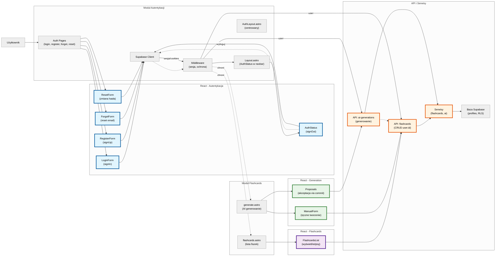

# Diagram Architektury UI - 10x-cards (Autentykacja + Flashcards)

Ten diagram wizualizuje strukturę UI na podstawie specyfikacji auth-spec.md i PRD prd.md. Pokazuje strony Astro, komponenty React, przepływ autentykacji i integrację z modułem flashcards. Zweryfikowany wobec codebase (komponenty w auth/generation/flashcards, API checks, middleware protection).

## Wyjaśnienie
- **Moduł Autentykacji**: Flow logowania/rejestracji z Supabase.
- **Moduł Flashcards**: Integracja chronionych stron (wymaga auth).
- **React - Generation**: Komponenty z generation/ (ManualForm, Proposals z akceptacją via commit API).
- **Przepływ**: Strzałki pokazują kierunek (sesja via cookies do middleware; proposals commit -> flashcards).
- **Kolory**: Autentykacja (niebieski), Flashcards (fioletowy), Generation (zielony), API (pomarańczowy), zaktualizowane (różowy).

Diagram jest w języku polskim, zgrupowany wg funkcjonalności i pokazuje zależności auth-flashcards. Poprawiona czytelność: układ poziomy, krótsze etykiety, większe czcionki. Zweryfikowany: grupowanie zgodne z codebase (generation/ osobno).